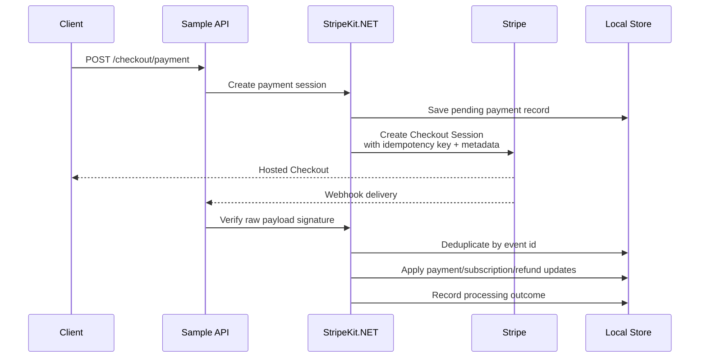

# StripeKit.NET

<p align="center">
  <strong>Reference-style Stripe integration for .NET 8</strong><br/>
  Hosted Checkout, verified webhooks, retry-safe processing, reconciliation, and a minimal ASP.NET Core sample API.
</p>

<p align="center">
  
  
  
  
  
  
</p>

## Why this project exists

Stripe integrations often look simple right up until retries, duplicate webhook deliveries, out-of-order events, refund safety, and local business-state correlation start to matter.

`StripeKit.NET` is a focused .NET 8 library plus a minimal sample API that demonstrates a more disciplined integration shape:

- **Hosted Checkout** for one-time payments and subscriptions
- **Raw-body webhook verification** before event processing
- **Idempotent create flows** for retry safety
- **Duplicate-safe webhook handling** by Stripe event id
- **Out-of-order event guards** to avoid state regression
- **Refund validation and persistence**
- **Recent-event reconciliation** through the same processing pipeline
- **Tracing and correlation tags** for operational visibility

The goal is not to be a giant abstraction over Stripe.  
The goal is to show a **clean, testable, payments-aware integration baseline** that a real team could extend.

---

## What it covers

### Core flows
- Create hosted Checkout sessions for **payments**
- Create hosted Checkout sessions for **subscriptions**
- Persist local payment / subscription records keyed by **business ids**
- Resolve or create Stripe customers while preserving **user correlation**
- Verify webhook signatures from the **exact raw request payload**
- Process webhook deliveries with **dedupe**, **retry-aware outcomes**, and **stale lease takeover**
- Update local payment, subscription, and refund state from Stripe events
- Backfill missing Stripe object ids from Checkout/webhook metadata
- Reconcile recent Stripe events through the **same processor** used by webhooks

### Engineering signals
- Small, explicit interfaces at external seams
- Typed options with validation
- In-memory stores in the library
- Demo ADO.NET-backed persistence in the sample API
- Unit and integration tests focused on edge cases, not only happy paths
- `ActivitySource` tracing plus structured correlation logging

---

## Architecture at a glance



---

## Repository layout

```text
src/StripeKit/                         Core library
samples/StripeKit.SampleApi/           Minimal ASP.NET Core sample API
samples/StripeKit.SampleApi/SampleStorage/
                                       Demo DB-backed store + schema
tests/StripeKit.Tests/                 Unit tests
tests/StripeKit.IntegrationTests/      Integration tests
docs/                                  Supporting notes and diagrams
```

---

## Sample API capabilities

The sample API exposes minimal endpoints to exercise the main flows:

- `POST /checkout/payment`
- `POST /checkout/subscription`
- `POST /refunds`
- `POST /webhooks/stripe`
- `POST /reconcile`

This keeps the integration surface concrete and easy to inspect.

---

## Quick start

### 1. Configure secrets
Set Stripe credentials via environment variables or configuration:

- `STRIPE_SECRET_KEY`
- `STRIPE_WEBHOOK_SECRET`

### 2. Run the sample API
```bash
dotnet run --project samples/StripeKit.SampleApi
```

### 3. Exercise the flows
Use the sample API to:
- create a payment Checkout session
- create a subscription Checkout session
- send Stripe webhooks to the webhook endpoint
- issue refunds
- replay recent events via reconciliation

---

## Testing

This repo includes both **unit tests** and **integration tests**, including coverage of subtle integration concerns such as:

- deterministic idempotency generation
- raw-body webhook verification contracts
- duplicate event handling
- retry-after-failure behavior
- stale processing lease takeover
- out-of-order payment/subscription events
- metadata-based backfill when Stripe object ids are initially missing
- refund guardrails and status updates
- reconciliation replay behavior

Run locally:

```bash
dotnet test
```

---

## Current scope

This repository currently focuses on:

- hosted Checkout flows
- webhook-driven state convergence
- refunds
- recent-event reconciliation
- observability hooks
- sample persistence adapters

It is best understood as a **reference-style integration kit and portfolio-quality implementation**, not as an all-in-one Stripe product surface.

---

## Tech stack

- **.NET 8**
- **ASP.NET Core**
- **Stripe.net**
- **ADO.NET** in the sample persistence adapter
- **xUnit**-style test projects for unit and integration coverage

---

## License

Add your preferred license here.
